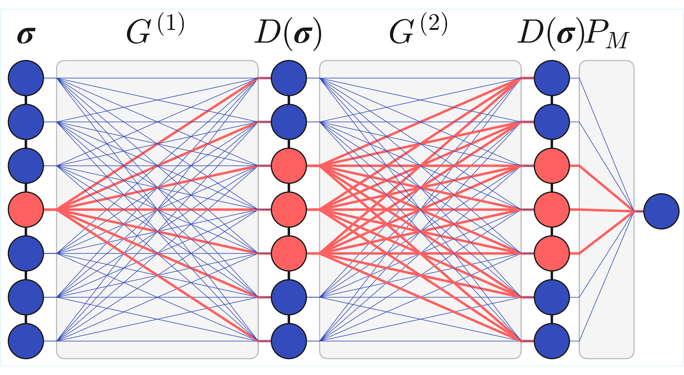
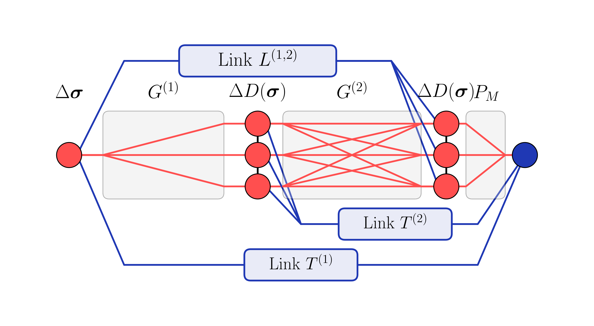
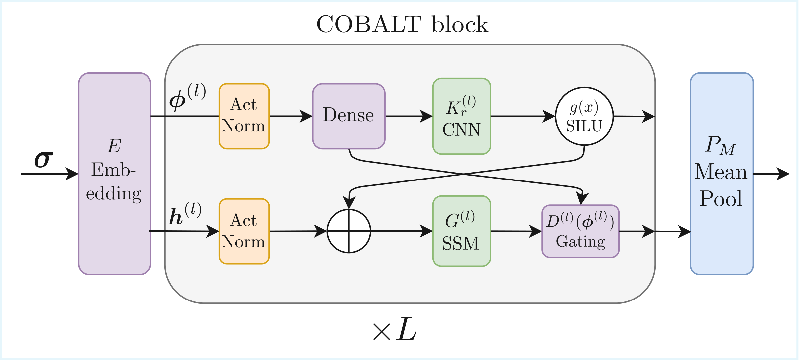

# DysonNet: Constant-Time Local Updates for Neural Quantum States

Implementation of the DysonNet architecture and ABACUS local-update algorithm for neural quantum states (NQS).

Paper: [arXiv:2603.11189](https://arxiv.org/abs/2603.11189) by Lucas Winter and Andreas Nunnenkamp.
Local copy: `DysonNet_Constant_Time_Local_Updates_for_Neural_Quantum_States.pdf` (January 23, 2026).


## Overview


<p align="center">
  <a href="Figures/network_diagram.pdf">
    
  </a>
  <a href="Figures/link_tensor_network_diagram.pdf">
    
  </a>
</p>


DysonNet is a class of NQS that couples strictly local nonlinearities through a global linear propagator. In the paper, this structure is interpreted as a truncated Dyson expansion, giving an intuitive picture of local wavefunction updates as multiple scattering from static impurities. By resumming the scattering series, the ABACUS algorithm computes single-spin-flip updates in O(1) time (independent of system size) using precontracted link tensors. The repository implements DysonNet with an S4 state-space model (SSM) token mixer and benchmarks it on long-range TFIM and frustrated J1-J2 chains.

## Features
- DysonNet blocks with global Green's-function-like convolution and strictly local nonlinearities.
- ABACUS constant-time local updates via link tensors and partial evaluation.
- S4-based token mixer with optional gated S4 blocks.
- Custom NetKet operator and sampler for fast local updates.
- Benchmarks for long-range TFIM and J1-J2 chains.
- Utilities for sweep-size schedules and training diagnostics.

## Architecture (COBALT Block)

The model follows the COBALT block layout shown below: spins are embedded into token features, passed through `L` stacked residual COBALT blocks, then mean-pooled and mapped to a scalar log-amplitude via a LogCosh head. The two internal streams in the diagram correspond to `x` (feature stream) and `g` (gating stream) in code.

<p align="center">
  <a href="Figures/COBALT.drawio_cropped.pdf">
    
  </a>
</p>

**Code map (figure element → implementation)**

| COBALT element | Where it lives |
| --- | --- |
| Embedding `E` | `dysonnet/DysonNQS.py` `DysonNet._embed_tokens` and embedding layers in `DysonNet.setup` |
| ActNorm on `phi^(l)` | `dysonnet/DysonNQS.py` `ActNorm` used as `ResidualBlockDyson.norm_x` |
| ActNorm on `h^(l)` | `dysonnet/DysonNQS.py` `ResidualBlockDyson.norm_g` (LayerNorm) |
| Dense projections | `dysonnet/DysonBlock.py` `DysonBlock.in_proj_x` (x stream) and `DysonBlock.in_proj` (gating stream) |
| CNN `K_r^(l)` | `dysonnet/DysonBlock.py` `DysonBlock.apply_convolution` with `conv1d` / `SymmetricDepthwiseConv1D` |
| SSM `G^(l)` (S4) | `dysonnet/DysonBlock.py` `DysonBlock.apply_s4`, kernel in `dysonnet/S4.py` (`S4Kernel_vmap`) |
| Gating `D^(l)(phi^(l))` | `dysonnet/DysonBlock.py` `DysonBlock.apply_gating` (uses `nn.silu` on `gate_val` and `out_proj`) |
| Residual COBALT block `× L` | `dysonnet/DysonNQS.py` `ResidualBlockDyson` wrapping `DysonBlock`, stacked in `DysonNet.setup` |
| Mean pool `P_M` | `dysonnet/DysonNQS.py` `DysonNet._dyson_finalize_output` (`jnp.sum(...)/seq_length`) |
| LogCosh head | `dysonnet/DysonNQS.py` `LogCoshLayer` |


## Project Structure

```
DysonNet/
|-- main.py                      # Main training entry point (long-range TFIM)
|-- dysonnet/                    # Core implementation
|   |-- DysonNQS.py              # DysonNet model + factory
|   |-- DysonBlock.py            # S4/Dyson blocks and symmetric convs
|   |-- S4.py                    # S4 kernel and utilities
|   |-- partial_evaluation.py    # Activation caching and slicing helpers
|   |-- link_tensors.py          # Link tensor construction + fast update paths
|   |-- custom_operator.py       # Fast TFIM/J1-J2 operators
|   |-- custom_sampler.py        # Fast Metropolis sampler (ABACUS path)
|   `-- utils.py                 # System setup, optimizers, schedules, long-range TFIM helpers
|-- Figures/                     # Paper figures used above
|-- tests/                       # Test suite
`-- DysonNet_Constant_Time_Local_Updates_for_Neural_Quantum_States.pdf
```

## Installation

This repository targets JAX/Flax/NetKet workflows. Install dependencies in your environment of choice.

Key dependencies (not exhaustive):
- `jax`, `jaxlib`
- `flax`, `optax`
- `netket`
- `einops`, `numpy`, `matplotlib`

If you are using the project's recommended environment:

```bash
~/.venvs/nqs/bin/python -m pip install -U pip
~/.venvs/nqs/bin/python -m pip install -U flax "netket==3.17.*"
~/.venvs/nqs/bin/python -m pip install -U "jax[cuda12]==0.5.3"
~/.venvs/nqs/bin/python -m pip install -U "jaxlib==0.5.3"
~/.venvs/nqs/bin/python -m pip install -U optax einops numpy matplotlib
```

Notebook/Colab-style installs (same pinned versions):

```bash
!pip install --upgrade pip
!pip install -U flax "netket==3.17.*"
!pip install -U "jax[cuda12]==0.5.3"
!pip install -U "jaxlib==0.5.3"
```

## Usage

### Basic Run (standard sampler)

```bash
~/.venvs/nqs/bin/python main.py --N 12 --n-iter 5 --n-samples 256 --output-dir runs/smoke
```

### Fast Local Updates (ABACUS)

```bash
~/.venvs/nqs/bin/python main.py \
  --N 12 --n-iter 5 --n-samples 256 \
  --sampler fast --fast-operator \
  --output-dir runs/smoke_fast
```

### Helpful Flags

- `--sampler`: `standard` or `fast`.
- `--fast-operator` (alias `--fast`): use the custom TFIM operator.
- `--partial-evaluation`: toggles partial-evaluation model path.
- `--n-blocks` (alias `--n-layers`): number of Dyson/S4 blocks.
- `--s4-include-interblock` (alias `--interblock`): include inter-block far-field handling.
- `--token-size`: token grouping for sequence reshaping and custom operator windows.
- `--n-iter`, `--n-samples`, `--n-discard-per-chain`: VMC loop parameters.
- `--output-dir` (alias `--save-dir`): where JSON logs and parameters are written.

Run `--help` for the full argument list.

## Output

Training runs write to `--output-dir` (default: `training_outputs`):
- JSON training history (energies, observables, parameters).
- Serialized model parameters.

## Tests

```bash
~/.venvs/nqs/bin/python -m pytest
```

## Citation

If you use this code or ideas from the paper, please cite:

```bibtex
@article{winter2026dysonnet,
  title={DysonNet: Constant-Time Local Updates for Neural Quantum States},
  author={Winter, Lucas and Nunnenkamp, Andreas},
  year={2026},
  journal={arXiv preprint arXiv:2603.11189},
  eprint={2603.11189},
  archivePrefix={arXiv},
  primaryClass={quant-ph},
  url={https://arxiv.org/abs/2603.11189}
}
```
